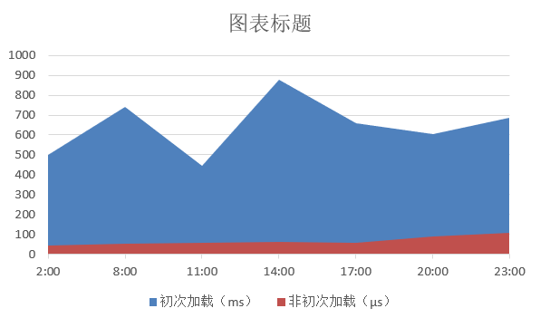
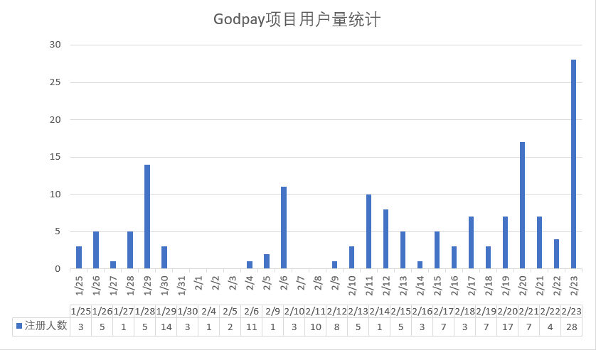
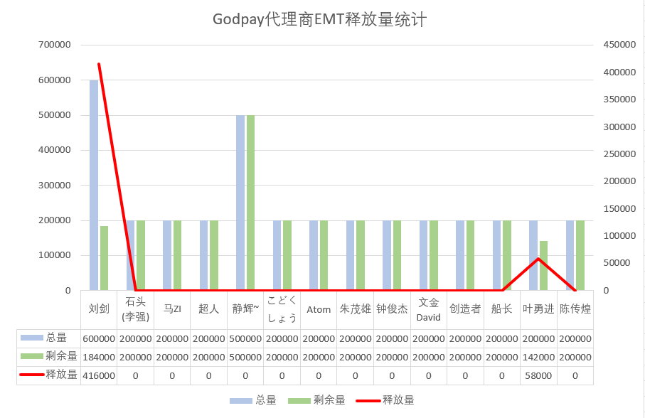
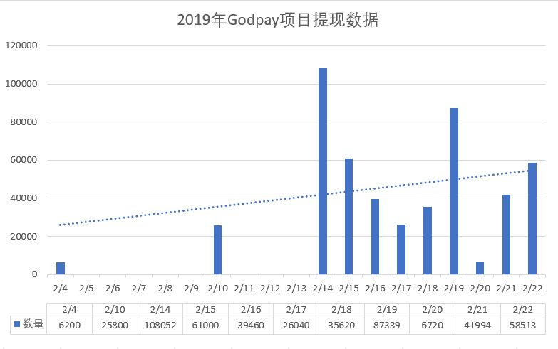

### 项目名称：Godpay
### 项目链接：[项目链接](https://bopinshangcheng.com/#/)
### 项目目标：***释放2亿EMT，促进EMT的市场流通***
### 项目规则：
  1. 产品设计：认权产品、众筹产品
  2. 认权产品：
      * 同一投入期，值允许购买一次
      * 分为三个等级：

          a. v1等级:购入值为2000EMT

          b. v2等级：购入值为4000EMT

          c. v3等级：购入值为8000EMT
      * 释放规则：释放总量按600天平均释放
  3. 众筹产品：
      * 购入数量必须>1000EMT，且必须先购入认权产品后才可购买
      * 分为三个类别：

          a. 定期3个月：利息为购入数量的2%

          b. 定期6个月：利息为购入数量的4.5%

          c. 定期12个月：利息为购入数量的10%
      * 释放规则：利息为每月（30天/月）初进行返还，本金则为返还所有利息后的最后一天返还
      * 限定规则：

          a. 购入v1等级认权产品的用户可购众筹次数为3次

          b. 购入v2等级认权产品的用户可购众筹次数为4次

          c. 购入v3等级认权产品的用户可购众筹次数为5次
  4. 收益规则（4类）：
      * 收益1：针对认权产品（倍化EMT不计入2亿总量）

          a.用户购入认权产品时，处于EMT释放的0-4000万阶段，则以认权产品的购入值为基础倍化4倍后作为用户的释放总量

          b.用户购入认权产品时，处于EMT释放的4000-8000万阶段，则以认权产品的购入值为基础倍化3倍后作为用户的释放总量

          c.用户购入认权产品时，处于EMT释放的8000万-2亿阶段，则以认权产品的购入值为基础倍化2倍后作为用户的释放总量
      * 收益2：针对认权产品

          a.购入v1产品的用户，其下级中有4名购入v3等级的认权产品，6名购入众筹产品，即可以认权产品的购入值为基础倍化3倍后叠加至释放总量

          b.购入v2产品的用户，其下级中有6名购入v3等级的认权产品，8名购入众筹产品，即可以认权产品的购入值为基础倍化3倍后叠加至释放总量

          c.购入v3产品的用户，其下级中有8名购入v3等级的认权产品，10名购入众筹产品，即可以认权产品的购入值为基础倍化3倍后叠加至释放总量
      * 收益3：针对众筹产品

          a.购入v1产品的用户，其下级购入众筹产品，其下级利息的8%将作为上级用户的额外收益(获得收益的时间为其下级返还本金的时间)

          b.购入v2产品的用户，其下级购入众筹产品，其下级利息的20%将作为上级用户的额外收益(获得收益的时间为其下级返还本金的时间)

          c.购入v3产品的用户，其下级购入众筹产品，其下级利息的50%将作为上级用户的额外收益(获得收益的时间为其下级返还本金的时间)

      * 收益4：针对认权产品，分为直推、间推两种情况，EMT释放提速，提速速率以***倍化后释放总量***为基数

          a.直推：\*表示认权产品任一等级

          本级 | 下级 | 提速速率
          :--:|:--:|:--:
          \* | v1 | 10%
          \* | v2 | 15%
          \* | v3 | 20%

          b.间推：\*表示认权产品任一等级

          本级 | 下级 | 下下级 | 提速速率
          :--:|:--:|:--: | :--:
          \* | v1 | v1 | 1%
          \* | v1 | v2 | 2.5%
          \* | v1 | v3 | 5%
          \* | v2 | v1 | 1.5%
          \* | v2 | v2 | 3.75%
          \* | v2 | v3 | 7.5%
          \* | v3 | v1 | 2%
          \* | v3 | v2 | 5%
          \* | v3 | v3 | 10%
### 项目需求，程序设计
    #### 项目技术设计：
    前端：
        UI框架：
            PC端：element框架
            移动端：mint-ui框架
        功能框架：vue.js + axios + v-router + vuex
    后端：
        语言：python
        框架：Django
    服务器：
        IP：120.79.181.233
        端口:80
    #### 页面设计：
     一、 客户端
        1. 登录：
            * 路由:'/'
            * 组件：login.vue
            * ajax请求：
                a. 登录功能：
                    + 接口路由：'/login'
                    + 请求方式：post
                    + 字段设计：
                        ```
                        user:{//用户信息
                                uphone:"",//用户账号或手机号,由用户输入获取，非空字段
                                password:"",//登录密码，由用户输入获取，非空字段
                                ip_in:"",//内网ip，允许为空
                                ip_out:"",//外网ip，利用，非空字段
                                equipment:"",//设备机型，非空字段
                            }
                        ```    
                        说明：
                        - ip_in:内网ip，getIPs函数中利用window的RTCPeerConnection、mozRTCPeerConnection、webkitRTCPeerConnection获取内网ip，*注意：手机端无法获取内网ip，所以后端设置ip_in必须允许为null*
                        - ip_out:外网ip，利用搜狐接口`<script src="https://pv.sohu.com/cityjson?ie=utf-8"></script>`获取外网ip，
                        - equipment:设备机型，利用navigator.userAgent获取设备机型信息。
                    + 返回字段：
                      `status_end：登录状态，ok则表示登录成功`
                    + 登录成功：
                      - 改变vuex中用户的登录状态，isLogin赋值为true
                      - 储存用户手机号至vuex中，供其他vue组件复用
        2. 注册：
            * 路由：'/register'
            * 组件：register.vue
            * ajax请求:
              a. 获取验证码：
                + 接口路由：'/send_sms'
                + 请求方式：post
                + 字段设计：
                  `uphone:用户手机号，用户输入获得，非空字段`
              b. 用户注册：
              + 接口路由：'/register'
              + 请求方式：post
              + 字段设计：
                ```
                user:{//用户信息
                    username:"",//用户昵称，非空字段
                    uphone:"",//用户手机，非空字段
                    password1:"",//用户密码，非空字段
                    password2:"",//用户重复密码，非空字段
                    code:"",//短信验证码，非空字段
                    referee:"",//推荐人，非空字段
                    ip_out:"",//外网IP，非空字段
                    ip_in:"",//内网IP，允许为空
                },
                ```
                *注意：推荐人是根据路径'/register/?uphone13113131212'携带推荐人信息，页面初始化时href.location获取网页路径，字符串截取substr手机号码后自动填写，如果路径携带推荐人的信息为null，则允许用户自己填写，否则，不允许用户更改*
              + 返回字段：
                `status_end：登录状态，ok则表示注册成功`
              + 注册成功后：
                - v-router的编程式导航进行跳转，跳转至'/'登录页面
        3. 设置登录/支付密码
          * 路由：'/updatepassword'
          * 组件：updatepassword.vue
          * ajax请求:
            a. 获取验证码：
              + 接口路由：'/send_sms'
              + 请求方式：post
              + 字段设计：
                `uphone:用户手机号，用户输入获得，非空字段`
            b. 设置/修改登录/支付密码：
              ```
                登录密码/支付密码的设置为同一个路由组件，根据路由参数$route.params.pwdKind判断设置密码的类型，为'login'则为设置登录密码，'pay'则为设置支付密码
              ```
              + 接口路由：'/modify_login'(设置登录密码)、'/modify_payment'(设置支付密码)
              + 请求方式：post
              + 字段设计：
                ```
                //登录密码：
                {
                    uphone:"",//用户手机号，非空字段
                    new_password:"",//密码，非空字段
                    confirm_password:"",//确认密码，非空字段
                    code:"",//验证码，非空字段
                },
                //支付密码：
                {
                    uphone://用户手机号，非空字段
                    new_password_payment://密码，非空字段
                    confirm_password_payment://确认密码，非空字段
                    code://验证码，非空字段
                }
                ```
              + 返回字段：
                `status_end：登录状态，ok则表示修改成功`
              + 设置成功后：
                - 所有字段，清空赋值
        4. 首页：
          * 路由：'/home'
          * 组件：home.vue
          * ajax请求:
            a. 获取产品信息：
              + 接口路由：'/index_views'
              + 请求方式：get
              + 返回字段：
                ```
                //认权产品：
                power_product:认权产品
                power_product_name:认权产品名称
                power_product_grade:认权产品等级

                //众筹产品
                crowdfunding_product:众筹产品
                crowdfunding_product_name:众筹产品名称
                crowdfunding_product_grade:众筹产品等级
                //根据crowdfunding_product_grade自定义字段：
                rate:众筹产品利率
                ```
              *注意：首页所有产品图片，包括等级小图标都是根据返回的产品信息做出判断后，设定所有图片的相对路径，用require引入*
        5. 产品介绍
          * 认权产品
            + 路由：'/right/:sort'，sort为认权产品的类型，值：v1、v2、v3；分别代表三种认权产品
            + 组件：right.vue
            + ajax请求:
              a. 获取认权产品详细信息：
                - 接口路由：'"/product_details/"+power_product_grade;'。power_product_grade即产品的类型
                - 请求方式：get
                - 返回字段：
                  ```
                    认权产品：power_product
                    认权产品名称：power_product_name
                    认权产品等级：power_product_grade
                    认权产品周期：power_product_zhouqi
                    认权产品原始值：power_product_quantity
                    认权产品详情：power_product_details
                    //根据power_product_grade自定义字段：
                    产品图片路径：imgUrl
                    产品等级路径：levelImgUrl
                  ```
              b. 购买认权产品：
                - 接口路由：'/order'
                - 请求方式：post
                - 字段设计：
                  ```
                  uid:'',//用户uid
                  key_password:'',//支付密码
                  order_product:'',//产品种类
                  ```
                - 返回字段：
                  ```
                    operation:购买状态，ok则表示购买成功
                  ```
                - 400状态码：
                  axios的catch获取error.response.status的400状态码，且用提示框mt-popup提示错误信息，且提示框5s后消失
          * 众筹产品
            + 路由：'/crowdfunding/:kind'，kind为众筹产品的类型，值：3M、6M、12M；分别代表三种众筹产品
            + 组件：crowdfunding.vue
            + ajax请求:
              a. 获取众筹产品详细信息：
                - 接口路由：'"/crowdfunding_details/"+crowdfunding_product_grade'。crowdfunding_product_grade即产品的类型
                - 请求方式：get
                - 返回字段：
                  ```
                    众筹产品名称：crowdfunding_product_name
                    众筹产品等级：crowdfunding_product_grade
                    众筹产品周期：crowdfunding_product_zhouqi
                    众筹产品最少值：crowdfunding_product_quantity
                    众筹产品中文名：chain_name
                    众筹产品英文名：engish_name
                    众筹产品别名：alias
                    众筹产品国籍：nationality
                    众筹产品出生日期：birthday
                    众筹产品职业：work
                    //根据crowdfunding_product_grade自定义字段：
                    产品大图路径：bigImg
                    产品小图路径：smallImg
                    产品周期：period
                  ```
              b. 购买众筹产品：
                - 接口路由：'/orderzhong'
                - 请求方式：post
                - 字段设计：
                  ```
                  uid://用户uid
                  key_password:_this.affirmPwd,//支付密码
                  order_quantity:Number(_this.crowdfundingNum),//购买数量
                  order_product:_this.kind,//产品种类
                  order_product_name://产品名称
                  ```
                - 返回字段：
                  ```
                    operation:购买状态，ok则表示购买成功
                  ```
                - 400状态码：
                  axios的catch获取error.response.status的400状态码，且用提示框mt-popup提示错误信息，且提示框5s后消失
        6. 分享
          * 路由：'/share'
          * 组件：share.vue
          * 二维码：
            + 生成二维码的插件：qrcode，生成二维码的函数qrCode(),生成二维码后利用插件QRCode.toCanvas方法将二维码生成canvas显示在页面，由于生成的二维码需要保存，所以必须将canvas转化为img格式，直接利用canvas.toDataURL("image/jpg")方法转化
          * ajax请求:
            a. 获取用户推广情况：
              + 接口路由：'/spread'
              + 请求方式：post
              + 字段设计：
                `uid:用户uid`
            + 返回字段：
              ```
              昵称：username
              推荐人昵称：referee_username
              直推人数：subordinate_total
              间推人数：lowersubordinate_total
              总倍化倍数：total_multiple
              总加速速率：PushBetweenAll
              ```
        7. 加速详情
          * 路由：'/accelarate'
          * 组件：accelarate.vue
          * ajax请求:
            a. 获取加速详情：
              + 接口路由：'/speed_details'
              + 请求方式：post
              + 字段设计：
                `uid:用户uid`
            + 返回字段：
              ```
              直推用户昵称：subordinate_username
            	直推用户等级：subordinate_grade
            	直推用户购买时间：subordinate_order_time
            	直推用户加速：subordinate_rate

            	间推用户昵称：lowersubordinate_username
            	间推用户等级：lowersubordinate_grade
            	间推用户购买时间：lowersubordinate_order_time
            	间推用户加速：lowersubordinate_rate

              //根据推荐用户的等级subordinate_grade/lowersubordinate_grade，自定义字段
              产品图片：imgType       
              ```
        8. 倍化详情
          * 路由：'/multiply'
          * 组件：multiply.vue
          * ajax请求:
            a. 获取倍化详情：
              + 接口路由：'/ploidy_details'
              + 请求方式：post
              + 字段设计：
                `uid:用户uid`
            + 返回字段：
              ```
              用户倍化倍数：power_multiple
            	用户购买时间：orders_time
            	用户购买第几阶段：user_stage
            	用户购买认权等级：user_grade

            	下级购买认权用户昵称：subordinate_username
            	下级购买认权用户购买时间：subordinate_order_time
            	下级购买认权用户购买第几阶段：subordinate_stage
            	下级购买认权用户购买认权：等级subordinate_grade
            	下级具体购买认权产品名称：subordinate_product

            	下级购买众筹用户昵称：crowdfunding_username
            	下级购买众筹用户购买时间：crowdfunding_time
            	下级购买众筹用户购买周期：crowdfunding_grade
            	下级具体购买众筹产品名称：crowdfunding_product

              //根据推荐用户的图片等级，自定义字段
              产品图片：imgUrl       
              ```
        9. 个人中心
          * 路由：'/personCenter'
          * 组件：personCenter.vue
          * ajax请求:
            a. 获取个人中心信息详情：
              + 接口路由：'/user_details'
              + 请求方式：post
              + 字段设计：
                `uid:用户uid`
              + 返回字段：
                ```
                昵称：username
              	等级：grade
              	钱包地址：wallt_address
              	剩余可购买众筹次数:surplus_buy
              	推荐购买认权人数比例：power_number
              	推荐购买众筹人数比例：crowdfunding_number
              	资产：assets
              	总量：total_quantity
              	总倍化：total_multiple
              	当天加速:PushBetweenAll
              	待返：pending_return_tatal
              	已返：returned_tatal
              	可用：can_use_quantity
              	可提：can_extract_tatal  
                //根据用户等级grade，自定义字段
                用户等级图片路径：levelImg     
                ```
              + 请求成功：
                请求成功后，将用户信息存储到vuex中，方便其他vue组件复用
            b. 提现申请：
              + 接口路由：'/cash_withdrawal'
              + 请求方式：post
              + 字段设计：
                ```
                数量：order_quantity
                支付密码：key_password
                用户id：user_id
                ```
              + 返回字段：
                ```
                用户ID：user_id
                手机号码：uphone        
                流水号：serial_number
                提现时间：order_time
                EMT提现钱包地址：CashWithdrawal_wallt_address        
                提现购买产品数量：order_quantity
                操作标识状态：operation  
                ```
              + 400状态码：
                axios的catch获取error.response.status的400状态码，且用提示框mt-popup提示错误信息，且提示框5s后消失

        10. 充值
          * 路由：'/recharge'
          * 组件：recharge.vue
          * ajax请求:
            a. 获取充值钱包地址：
              + 接口路由：'"/company_address/"+uid' 。uid:用户uid
              + 请求方式：get
              + 返回字段：
                ```
                company_address:  充值的钱包地址  
                ```
              + 请求成功后：
                利用qrcode插件，将地址生成canves二维码，再利用canvas.toDataURL("image/jpg")将canves格式转化为img格式
            *注意：充值部分，包括用户向代理商申请EMT充值功能，暂注释此部分功能的代码，取消代码注释，即可复用申请功能*
        11. 订单
          * 路由：'/order'
          * 组件：order.vue
          * ajax请求:
            a. 获取购入产品的订单，其中包括获取购入认权产品、购入众筹产品的订单：
              + 接口路由：
                认权产品：'"/renquan_check/"+uid'。uid:用户uid
                - 请求方式：get
                - 返回字段：
                  ```
                  订单号：'serial_number',   
                  产品名称：'order_product',
                  产品数量:'order_quantity',
                  下单时间：'order_time'
                  周期：'zhouqi'
                  图片：'image_url'
                  状态：'operation'
                  //根据返回的order_product字段，自定义字段
                  等级图片：levelImg
                  产品图片：productImg
                  ```
                - 请求成功后：
                    获得返回数据后必须和众筹产品订单信息进行合并操作
                众筹产品：'"/zhongchou_check/"+uid' 。uid:用户uid
                - 请求方式：get
                - 返回字段：
                  ```
                  订单号：'serial_number',
                  众筹周期：'order_product',
                  众筹数量：'order_quantity',
                  众筹时间：'order_time'，
                  周期：'zhouqi'
                  图片：'image_url'
                  状态：'operation'
                  //根据返回的order_product字段，自定义字段
                  产品图片：productImg
                  ```
                - 请求成功后：
                    获得返回数据后必须和认权产品订单信息进行合并操作
          *注意：getPurchaseOrder()函数获取买入订单，分别获取认权、众筹订单，再做合并两个订单信息，按时间time排序显示*
            b. 获取提现订单：
            + 接口路由：'"/tixian_check/"+uid' 。uid:用户uid
            + 请求方式：get
            + 返回字段：
              ```
              订单号：'serial_number',
              提现钱包地址：'CashWithdrawal_wallt_address',
              提现数量：'order_quantity',
              下单时间：'order_time',
              状态：'operation'  
              ```
            c. 获取充值的订单，其中包括获取用户通过二维码充值的订单、代理商转账的订单：
              + 接口路由：
                二维码充值：'"/chongzhi_check/"+uid'。uid:用户uid
                - 请求方式：get
                - 返回字段：
                  ```
                  订单号：'serial_number',
                  钱包地址：'CashWithdrawal_wallt_address',
                  充值数量：'order_quantity',
                  下单时间：'order_time',
                  状态：'operation'
                  ```
                - 请求成功后：
                    获得返回数据后必须和代理商转账的订单信息进行合并操作
                代理商转账充值：'"/user_agent_chongzhi_check/"+uid' 。uid:用户uid
                - 请求方式：get
                - 返回字段：
                  ```
                  订单号：'serial_number',
                  钱包地址：'CashWithdrawal_wallt_address',
                  充值数量：'order_quantity',
                  下单时间：'order_time',
                  状态：'operation'
                  ```
                - 请求成功后：
                    获得返回数据后必须和用户二维码充值的订单信息进行合并操作
          *注意：getRechargeOrder()函数获取充值订单，分别获取二维码充值、代理商转账充值的订单，再做合并两个订单信息，按时间time排序显示*
        12. EMT钱包地址
          * 路由：'/walletAddress'
          * 组件：walletAddress.vue
          * ajax请求:
            a. 设置钱包地址：
              + 接口路由：'/binding_wallt'
              + 请求方式：post
              + 字段设计：
                ```
                wallt_address:"",//钱包地址
                confirm_wallt_address:"",//确认钱包地址
                payment_password:"",//支付密码
                ```
              + 返回字段：
                ```
                status_end:设置状态，ok则表示设置成功
                ```
        13. 退出登录
            *退出登录功能在个人中心页面(personCenter.vue),此功能无需发送ajax请求，只需将vuex中的登录状态改为false以及用户信息清空即可*
     二、 代理商管理
        1. 登录页
          * 路由：'/agentLogin'
          * 组件：agentLogin.vue
          * ajax请求:
            a. 代理商登录请求：
              + 接口路由：'/agent_login'
              + 请求方式：post
              + 字段设计：
                ```
                agent_uphone: "",//手机号
                agent_password: "",//登录密码
                agent_login_equipment:"",//登录设备
                agent_intranet_ip:"",//内网ip
                agent_extranet_ip:"",//外网ip
                ```
              + 返回字段：
                ```
                status_end:设置状态，ok则表示登录成功
                ```
              + 登录成功后：
                将vuex中的代理商登录状态改为登录状态，并将代理商信息agentInfo：代理商名称agentInfo.agent_name，代理商手机号agentInfo.agent_quantity，代理商EMT数量agentInfo.agent_uphone存储只vuex，再跳转至'/agentHome'，代理商首页
        2. 代理商首页：
            * 路由：'/agentHome'
            * 组件：agentHome.vue
            * ajax请求：
              a. 获取验证码：
                + 接口路由：'/send_sms'
                + 请求方式：post
                + 字段设计：
                  `uphone:用户手机号，用户输入获得，非空字段`
              b. 获取代理商基本信息：
                *直接从vuex中获取代理商基本信息，$store.state.agentInfo则包括代理商名称，代理商手机号，代理商EMT资产*
              c. 设置登录密码/支付密码，setting(type)，type：设置的密码类型，0：登录密码，1：支付密码
                  + 接口路由：
                    登录密码：'/agen_login_secret'
                    支付密码：'/agen_payment_secret'
                  + 请求方式：post
                  + 字段设计：
                    ```
                    login:{//登录密码字段
                        agent_uphone:"",//手机号
                        code:"",//验证码
                        // old_agent_password:"",//原密码
                        new_agent_password:"",//新密码
                        confirm_new_agent_password:"",//重复新密码
                    },
                    pay:{//支付密码字段
                        agent_uphone:"",//手机号
                        code:"",//验证码
                        payment_agent_password:"",//密码
                        confirm_payment_agent_password:"",//重复新密码
                    },
                    ```
                  + 返回字段：
                    *返回一个ok，则表示设置成功*
              d. 修改手机号：
                + 接口路由：'/change_uphone'
                + 请求方式：post
                + 字段设计：
                  ```
                    uphone://新手机号
                    account_number://代理商旧手机号
                  ```
                + 返回字段：
                  *返回一个ok，则表示设置成功*
                + 抛出错误：
                  *接收错误信息，用弹出框弹出消息提示*
        3. EMT申请管理：
            * 申请EMT
              + 路由：'/applyEMT'
              + 组件：applyEMT.vue
              + ajax请求：
                a. 申请EMT：
                  - 接口路由：'/agent_recharge'
                  - 请求方式：post
                  - 字段设计：
                    ```
                    allocate_quantity:"",//申请EMT数量
                    key_password:"",//密码
                    ```
                  - 返回字段：
                    ```
                    allocate_quantity：申请数量，>0则申请成功
                    ```
                  - 400状态码：
                    axios的catch获取error.response.status的400状态码，且用提示框mt-popup提示错误信息，且提示框5s后消失
            * 指定转账
              + 路由：'/transferAccount'
              + 组件：transferAccount.vue
              + ajax请求：
                a. 指定转账给用户：
                  - 接口路由：'/agent_transfer'
                  + 请求方式：post
                  + 字段设计：
                    ```
                    user_uphone://用户手机号
                    agent_uphone://代理商手机号
                    apply_quantity://申请数量
                    key_password://支付密码
                    ```
                  + 返回字段：
                    ```
                    agent_code：值为'转账成功'则表示成功状态
                    ```
            * EMT申请审核
              *注意：由于用户直接向代理商申请EMT的功能暂时取消，所以显示用户向代理商申请EMT的信息暂时取消*
        4. 申请状态
          *注意：由于用户直接向代理商申请EMT的功能暂时取消，所以显示历史用户向代理商申请EMT的信息暂时取消*
        5. 代理商账本
          + 路由：'/accountBook'
          + 组件：accountBook.vue
          + ajax请求：
            a. 指定转账给用户：
              - 接口路由：'"/agent_Account_book/"+agent_uphone'。agent_uphone代理商手机号
              - 请求方式：get
              - 返回字段：
                ```
                代理商可转EMT数量："agent_quantity"
                代理商已转EMT数量：'agent_turned_quantity'
                ```
     三、 超级管理员后台
        1. 管理员登录：
          * 路由：'/adminLogin'
          * 组件：adminLogin.vue
          * ajax请求:
            a. 管理员登录请求：
              + 接口路由：'/Super_Manager_login'
              + 请求方式：post
              + 字段设计：
                ```
                手机号:account_number
              	密码：password
              	外网ip：ip_out
              	内网ip:ip_in
              	登录设备：equipment
                ```
              + 返回字段：
                ```
                返回'登陆成功'则表示登录状态
                ```
              + 登录成功后：
                将vuex中的管理员登录状态改为登录状态，并将管理员信息account_number：管理员手机号，存储至vuex，再跳转至'/admin'，管理员首页
        2. 代理商管理：
            * 开通代理
              + 路由：'/openUp'
              + 组件：openUp.vue
              + ajax请求：
                a. 开通代理商账户：
                  - 接口路由：'/agent_establish'
                  - 请求方式：post
                  - 字段设计：
                    ```
                    agent_name:"",//代理商用户名
                    agent_uphone:"",//
                    key_password:"",//代理商登录密码
                    login_password:"",//确认代理商密码
                    ```
                  - 返回字段：
                    `operation：进行中，表示开通成功`
                  - 400状态码：
                    axios的catch获取error.response.status的400状态码，且用提示框mt-popup提示错误信息，且提示框5s后消失
            * 管理代理
              + 路由：'/manageAgent'
              + 组件：manageAgent.vue
              + ajax请求：
                a. 获取代理商账户：
                  - 接口路由：'/agent_operation_show'
                  - 请求方式：get
                  - 返回字段：
                    ```
                    代理商手机号码：agent_uphone
                    代理商名称：agent_name
                    代理商生成时间：agent_time
                    代理商状态：operation
                    ```
                b. 暂停代理商业务：
                  - 接口路由：'/agent_suspend'
                  - 请求方式：post
                  - 字段设计：
                    ```
                    agent_uphone：选择的代理商，多选，以列表的形式，如['13412121313','13412121314']
                    ```
                  - 返回字段：
                    `'已暂停',表示暂停成功`
                  *注意：暂停后，刷新代理商账户信息*
            * EMT申请审核：
                + 待审批
                  - 路由：'/agentApplyEMT'
                  - 组件：agentApplyEMT.vue
                  - ajax请求：
                    a. 获取代理商申请EMT审核列表：
                      + 接口路由：'/agent_apply_show'
                      + 请求方式：get
                      + 返回字段：
                        ```
                        代理商手机号：agent_uphone
                        代理商账号：account_number
                        代理商申请时间：allocate_time
                        代理商申请数量：allocate_quantity
                        代理商申请状态：operation
                        代理商申请的流水单号：serial_number
                        ```
                    b. 同意代理商EMT的申请
                      + 接口路由：'/agent_apply_agree'
                      + 请求方式：post
                      + 字段设计：
                        ```
                        serial_number,//流水单号
                        allocate_quantity,//申请数量
                        agent_uphone,//代理商手机号
                        ```
                      + 返回字段：
                        ```
                        '已同意'表示同意成功
                        ```
                    c. 拒绝代理商EMT的申请
                      + 接口路由：'/agent_apply_refuse'
                      + 请求方式：post
                      + 字段设计：
                        ```
                        serial_number,//流水单号
                        ```
                      + 返回字段：
                        ```
                        '已拒绝'表示拒绝成功
                        ```
                + 历史审批
                  - 路由：'/historyApply'
                  - 组件：historyApply.vue
                  - ajax请求：
                    a. 获取代理商申请EMT历史审核列表：
                      + 接口路由：'/agent_history_show'
                      + 请求方式：get
                      + 返回字段：
                        ```
                        代理商手机号：agent_uphone
                        代理商账号：account_number
                        代理商申请时间：allocate_time
                        代理商申请数量：allocate_quantity
                        代理商申请状态：operation
                        代理商申请的流水单号：serial_number
                        ```
        3. 客户管理：
            * 客户信息
              - 路由：'/userInfo'
              - 组件：userInfo.vue
              - ajax请求：
                a. 获取所有用户信息列表：
                  + 接口路由：'/super_admin_user'
                  + 请求方式：get
                  + 返回字段：
                    ```
                    用户手机号码：uphone
                    用户昵称：username
                    用户钱包地址:wallt_address
                    用户购买认权产品:power_grade
                    用户购买众筹次数：crowdfunding_count
                    ```
            * 认权明细
              - 路由：'/rightDetails'
              - 组件：rightDetails.vue
              - ajax请求：
                a. 获取认权明细信息：
                  + 接口路由：'/super_admin_power'
                  + 请求方式：get
                  + 返回字段：
                    ```
                    用户昵称：username
                    用户手机号码：uphone
                    用户购买认权产品：power_grade
                    用户购买认权下单时间：power_tiome
                    用户购买认权产品数量：power_quantity
                    ```
            * 众筹明细
              - 路由：'/crowdfundingDetails'
              - 组件：crowdfundingDetails.vue
              - ajax请求：
                a. 获取众筹明细信息：
                  + 接口路由：'/super_admin_crowdfunding'
                  + 请求方式：get
                  + 返回字段：
                    ```
                    用户昵称：username
                    用户手机号码：uphone
                    用户购买众筹产品：crowdfunding_product
                    用户购买众筹产品数量：crowdfunding_quantity
                    用户购买众筹产品下单时间：crowdfunding_time
                    用户购买众筹产品已返数量：crowdfunding_returned_quantity
                    用户购买众筹产品待返数量：crowdfunding_pending_return_quantity
                    ```        
            * 发展明细
              - 路由：'/developDetails'
              - 组件：developDetails.vue
              - ajax请求：
                a. 获取发展明细信息：
                  + 接口路由：'/super_admin_spread'
                  + 请求方式：get
                  + 返回字段：
                    ```
                    用户昵称：username
                    用户手机号码：uphone
                    用户购买认权产品：power_grade
                    用户购买认权产品数量：power_quantity
                    用户直推人数：Subordinate
                    用户间推人数：LowerSubordinate
                    ```      
            * 推荐明细
              - 路由：'"/recommendDetails/:userPhone"'，userPhone，用户手机号
              - 组件：recommendDetails.vue
              - ajax请求：
                a. 获取推荐明细信息：
                  + 接口路由：'/super_spread_details'
                  + 请求方式：post
                  + 字段设计：
                  `uphone:用户手机号`
                  + 返回字段：
                    ```
                    下级用户手机号码：subordinate_uphone
                    下级用户昵称：subordinate_username
                    下级用户购买等级：subordinate_grade
                    下级用户被推荐注册时间：subordinate_time
                    下级用户购买认权产品的量：subordinate_quantity
                    下级用户与该用户的关系：直推

                    下下级用户手机号码：lowersubordinate_uphone
                    下下级用户昵称：lowersubordinate_username
                    下下级用户购买等级：lowersubordinate_grade
                    下下级用户被推荐注册时间：lowersubordinate_time
                    下下级用户购买认权产品的量：lowersubordinate_quantity
                    下下级用户与该用户的关系：间推
                    ```      
            * 客户风控
              - 路由：'/risk'
              - 组件：risk.vue
              - ajax请求：
                a. 获取用户信息：
                  + 接口路由：'/super_user_control'
                  + 请求方式：get
                  + 返回字段：
                    ```
                    用户手机号码：user_uphone
                    用户昵称：user_username
                    用户注册时间：user_time
                    用户状态；user_operation
                    ```
                b. 风控用户：
                  + 接口路由：'/super_user_change_operation'
                  + 请求方式：post
                  + 字段设计：
                  ```
                  'operation':风控类型，值：'暂停'、'冻结'、'恢复',
                  'uphone':选取的用户，多选，以列表的形式，如['13412121313','13412121314']
                  ```
                  + 返回字段：
                    ```
                    用户手机号码：user_uphone
                    用户昵称：user_username
                    用户注册时间：user_time
                    用户状态；user_operation
                    //返回的用户信息，根据返回的用户个数，判断是否风控成功
                    ```        
        4. 平台数据管理：
            * EMT认权数据
              - 路由：'/emtRight'
              - 组件：emtRight.vue
              - ajax请求：
                a. 获取EMT认权相关的数据信息：
                  + 接口路由：'/super_power'
                  + 请求方式：get
                  + 返回字段：
                    ```
                    用户手机号码：user_uphone
                    用户昵称：user_username
                    用户注册时间：user_time
                    用户状态；user_operation
                    ```
            * EMT众筹数据
              - 路由：'/emtCrowdfunding'
              - 组件：emtCrowdfunding.vue
              - ajax请求：
                a. 获取EMT众筹相关的数据信息：
                  + 接口路由：'/super_crowdfunding'
                  + 请求方式：get
                  + 返回字段：
                    ```
                    orders_qiantity_total:产品数量,
           	        product_name:产品名称
                    ```
            * 客户分布管理
              - 路由：'/userDistribution'
              - 组件：userDistribution.vue
              - ajax请求：
                a. 获取客户分布层级关系信息：**暂未完成**
        5. 产品管理：**未完成**
            * 认权产品管理
            * 众筹产品管理
        6. 财务管理：
            * 提取EMT申请审批
              + 路由：'/auditWithdraw'
              + 组件：auditWithdraw.vue
              + ajax请求：
                a. 获取申请EMT提现的用户信息：
                  - 接口路由：'/super_Cash_withdrawal'
                  - 请求方式：get
                  - 返回字段：
                    ```
                    手机号码：uphone，
                    订单流水号：serial_number，
                    下单时间：order_time，
                    提现钱包地址：CashWithdrawal_wallt_address，
                    提现数量：order_quantity，
                    操作标识：operation
                    ```
                b. 同意提现：
                  - 接口路由：'/super_Cash_withdrawal_Agree'
                  - 请求方式：post
                  - 字段设计：
                  `serial_number,//流水单号`
                  - 返回字段：
                    ```
                    '已同意'表示同意成功
                    ```
                c. 拒绝提现：
                  - 接口路由：'/super_Cash_withdrawal_refuze'
                  - 请求方式：post
                  - 字段设计：
                  `serial_number,//流水单号`
                  - 返回字段：
                    ```
                    '已拒绝'表示拒绝成功
                    ```
                d. 一键同意提现：
                  - 接口路由：'/super_Cash_withdrawal_Agrees'
                  - 请求方式：post
                  - 字段设计：
                  `serial_number,//流水单号，多选，以列表的形式，如['2019021407472220190125120223458320TT440300','2019021415335420190126150300480236TT440300']`
                  - 返回字段：
                    ```
                    '已同意'表示同意成功
                    ```
                e. 一键拒绝提现：
                  - 接口路由：'/super_Cash_withdrawal_refuzes'
                  - 请求方式：post
                  - 字段设计：
                  `serial_number,//流水单号，多选，以列表的形式，如['2019021407472220190125120223458320TT440300','2019021415335420190126150300480236TT440300']`
                  - 返回字段：
                    ```
                    '已拒绝'表示拒绝成功
                    ```
            * 历史审批查询
              + 路由：'/historyAudit'
              + 组件：historyAudit.vue
              + ajax请求：
                a. 获取EMT提现记录的历史信息：
                  - 接口路由：'/super_Cash_withdrawal_history'
                  - 请求方式：get
                  - 返回字段：
                    ```
                    手机号码：uphone，
                    订单流水号：serial_number，
                    下单时间：order_time，
                    提现钱包地址：CashWithdrawal_wallt_address，
                    提现数量：order_quantity，
                    操作标识：operation
                    ```
### 项目BUG汇总及部分常见功能实现的总结
  一、前端：
    1. 跨域问题：本地开发环境访问服务器
```
XMLHttpRequest cannot load http://localhost:8080/. No 'Access-Control-Allow-Origin' header is present on the requested resource. Origin 'http://localhost:8080/' is therefore not allowed access.
```
处理方法：
前端部分做以下处理即可：
```
//在/config/index.js中：
module.exports = {
  dev: {
        proxyTable: {
             '/api':{
                 target:'http://bopinshangcheng.com',//服务器域名，不需要带端口号，如果是服务器ip地址，则需要带端口号
                 changeOrigin:true,//处理跨域接口
                 pathRewrite:{
                     '^/api':''//处理当接口路径中出现了'api'是重写为空
                 }
            }
        },
    }
}
```
```
//在vue组件中：
//登录
        login(){
            let _this = this;      
            let api = '/api/login';//每个接口路径前面都加上'/api'，通过代理会访问到服务器，而此'/api'会被重写为''
            _this.axios.post(api,_this.user).then(res=>{
                console.log('res',res);
            }).catch(error=>{
                console.log(error);
            });
        },
```
***注意：设置了代理后，不需要设置baseURL！！！不需要设置baseURL！！！不需要设置baseURL！！！上传到服务器运行时，只需要将所有接口中的‘/api’去掉即可***
    2. 同一个显示区块，获取两个接口信息：
      ***同一个函数获取多个接口的数据时，需要对多个接口的数据都进行处理，因为无法得知请求返回的时间点，谁先谁后，所以必须对多个接口返回的数据都进行处理***
```
  eg:
  //获取所有购入产品的订单，需要访问购入认权和购入众筹的两种产品的订单
  getPurchaseOrder(){
    //console.log('买入订单');
      let _this = this;
      _this.purchase = [];//清空数组，避免重复添加订单信息
      //认权和购买订单统一放入数组
      _this.getRightOrder();//获取认权订单
      _this.getCrowdOrder();//获取众筹订单
  },
  //获取认权订单信息
    getRightOrder(){
      let  _this = this;
      let api = '/renquan_check/'+_this.$store.state.uid;//认权产品订单的api
      //请求认权订单
      _this.axios.get(api).then(res=>{
      //    console.log('认权',res);
          let rightOrder = res.data;
          if(rightOrder == []){//认权订单为[]，则不需要执行下面的合并操作
              return
          }
          _this.purchase = _this.purchase.concat(rightOrder);//将认权订单合并到购入产品的订单的总数组中
      });  
    },
    //获取众筹订单信息
    getCrowdOrder(){
        let  _this = this;
        let api = '/zhongchou_check/'+_this.$store.state.uid;//众筹产品订单的api
        //请求众筹订单
         _this.axios.get(api).then(res=>{
          //    console.log('众筹',res);
              let crowdOrder = res.data;
              if(crowdOrder == []){//众筹订单为[]，则不需要执行下面的合并操作
                  return
              }
          _this.purchase = _this.purchase.concat(crowdOrder);//将众筹订单合并到购入产品的订单的总数组中
         });  
    },
```
3. 首页加载过慢：
  原因：最初程序设计时，未考虑到项目需要pc端和移动端两种适配，所以在最初引入项目UI框架时，引入的是mint-ui，移动端的ui的框架，而不是响应式框架，所以为了适配pc端，又引入了一个element-ui框架，且并不是按需引入，而是全局引入，所以导致整个项目引入的模块较多，加载时vendor.js过大，导致加载过慢。
  解决方案：
  ①在设计程序时，需要先做好规划
  ②补救方案：用多个服务器实现负载均衡，进行分流加速，从而实现加载速度的提高，如CDN加速服务
  ③利用gzip压缩文件
4. tingyun.js报错：
  ```
    cannot read property 'sdp' of null
  ```
  sdp：文本协议，定义点对点之间媒体会话时客户端描述自己的字符串格式，从而进行媒体参数的协定。
  原因：由于网络问题，加载延迟，tingyun.js还未加载，就读取了sdp属性所以报错
  解决方案：根据sdp协议的文本格式，定义js的加载顺序
5. 登录验证：
   + 在每个vue组件配置路由是利用路由的meta属性，定义一个字段验证，当前组件是否需要登录状态才可访问
   ```
  //路由
  {
        path: '/admin',
        name: 'admin',
        meta: {
          Auth: true, // 需要登录
        },
        component: Admin
  }
  ```
  + 在vuex中定义一个字段，登录状态字段
  ```
  //store
  import Vue from 'vue'
  import Vuex from 'vuex'
  Vue.use(Vuex);

  const state = {
    islogin:false
  }
  ```
  + 在初始化vue组件时对是否需要登录状态进行验证，然后对是否为登录状态进行验证，利用全局的路由钩子函数全局验证
  ```
  //main.js
  router.beforeEach((to, from, next) => {
    if (to.meta.Auth) {//需要登录
      if (store.state.islogin) {
        next();
      } else {
        router.push({ name: 'login' })
      }
    } else {//不需要登录
      next();
    }
  })
  ```
6. 'application/x-www-form-urlencoded'数据格式：
  form表单提交的数据格式有两种：一种是'multipart/form-data'，一种是"application/x-www-form-urlencoded"，
  ①"content-type":"application/x-www-form-urlencoded"
  传送的数据为普通的key:value数据，表单输入框提交的数据默认为此种：
  ```
  //main.js
  //引入node.js中的qs模块
  Vue.prototype.qs = require('qs')
  //在vue组件的js中
  login(){
      let _this = this;
      let api = '/api/login';
      _this.user = {//用户信息
              uphone:"",//用户账号或手机号
              password:"",//登录密码
          };
      _this.axios.post(api,_this.qs.stringify(_this.user)）.then(res=>{
          console.log(res);
          });
      //注意，其中的_this.user就为普通的json数据
      //qs.stringify()将json数据处理为字符串式表单数据
  }
  ```
  ②"content-type":"multipart/form-data"
  传送的数据一般为文件、图片等数据，此时，需要对数据进行如下处理：
  ```
  //在vue的js中
  data(){
      return{
          params:{
              file:"",//上传文件
          }
      }
  }
  methods:{
      update(){
          let _this = this;
          let fd = _this.transformData(_this.params);
         let api = '/api/updateFile';
          _this.axios.post(api,fd,{
              headers:{
                  "content-type":"multipart/form-data"
              }
              }）.then(res=>{
              console.log(res);
              });
      },
      // 转化为formdata格式
      transformData(obj){
          let _this = this;
          let fd = new FormData();
          Object.keys(obj).forEach(key=>{
              fd.append(key,obj[key]);
          });
          return fd;
      }
  }
  ```
7. 交互数据结构不统一：
  前期程序设计时，没有对交互数据的结构协商确定，导致后期程序测试阶段，一旦数据结构发生改变，页面显示即出现错误，调整此类错误，花费大量的时间。
  解决方案：前期程序的设计规划完善。
8. 移动端登录无响应：
  程序测试阶段，发现pc端登录跳转能正常实现，但是移动端登录无任何响应。
  原因：最初登录功能的字段设计：用户手机号，密码，内网ip，外网ip，设备机型，且所有字段都为必须字段，但是移动端，没有内网ip，导致非空字段传值为null，ajax请求报500错误，登录操作无响应
  解决方案：利用抓包工具，找出登录操作无响应的根本原因（内网ip字段为null），后端程序中，设定此字段允许为null，以及需要加强pc端，移动端各项应用终端的差异
9. 重复注册的问题：
  原因：用户输入基本信息后，连续点击注册按钮，同时发送多次ajax请求，导致后端接收多次注册请求。
  解决方案：设定30s不允许重复提交注册申请，设定一个标识符30s，每次点击注册按钮后，每1秒减1，下一次点击注册按钮时，看标识符是否小于30，一旦小于30则不允许发送ajax请求。用watch监控标识符，一旦标识符为0时，再初始化为30。
  二、后端
    1. 无需登录，即可直接访问接口，获得数据：
      原因：程序初期设计时，未做好规划，导致后端编写程序时，未做好登录状态的验证
      解决方案：
      根据用户登录信息：手机号、密码、内网ip、外网ip、设备机型，时间等信息，通过算法，加密成登录状态验证码，所有接口都必须传入加密验证码进行状态验证，验证码在15分钟内未操作的情况下，加密验证码失效，需要重新登录
    2. 数据库结构紊乱：
      原因：初期程序设计规划时，考虑不完善，仅考虑到将所有数据添加进数据库，未考虑到前后端数据交互时，提取数据时的便利性，设计的数据库结构不够完善，每个页面的访问，数据的显示都需要遍历多张数据表，才能获得所有所需数据
      后果：后期pv较大时，可能会造成数据奔溃。
      解决方案：
      ①初期程序设计时，就应考虑完善创建数据库，方便数据的读取
      ②利用rds关系型数据库进行优化
    3. 图片处理无法正常显示：
      原因：前后端交互传回的图片绝对路径无效。
      解决方案：
      ①临时方案：根据返回的数据做出判断，绑定相对路径，显示图片。
      ②根本解决方案：了解图片的各种处理，以及前后端数据交互时图片绝对路径的处理
    4. 绑定钱包地址不成功：
      前端页面操作钱包地址的绑定，但是，绑定并未在数据库生效
      原因：前端传送钱包地址至后端，后端将钱包地址存储至数据库，数据表中必填字段未处理，导致钱包地址未存储成功
      解决方案：重新检查绑定钱包接口的所有字段，按字段设计规则传送字段
    5. 注册无法生成uid：
      原因：地址库中部分地区未分配地址标识符，所以外网ip传送至后台后，无法匹配正确的地址标识，在uid设定的规则中，地址标识又为必须部分，所以无法成功生成用户uid
      解决方案：查漏补缺，将中国所有的省市自治区都匹配唯一的地址标识符
### 项目进度（2018/12/11-2019/02/20)
  一、 2018/12/11 - 2018/12/20 &nbsp;&nbsp;&nbsp; Godpay项目需求对接，确认需求初版，其中包括：
    &#160; &#160; &#160; &#160;1. 了解项目规则，产品、收益类型
    &#160; &#160; &#160; &#160;2. 完成了提取Godpay项目中的关键字，整理整个项目的逻辑，如：V1、V2、V3、3个月（2%）、6个月（4.5%）、12个月（10%）、ID、手机号、昵称、流水号、原始值（等级）、倍化、参考值、累计（释放总量）等
    &#160; &#160; &#160; &#160;3. 完成了Godpay项目中客户端页面需求确认，其中包括登录页、注册页、首页（产品链接按钮、规则、产品购买的实时通知）、产品信息页（认权、众筹两种产品的详情）、个人中心页（用户的基本信息，用户操作的订单管理、用户的资产情况、分享、用户的推广情况等部分的需求分析）
  二、 2018/12/21 &nbsp;&nbsp;&nbsp;Godpay需求调整，变动部分：
    &#160; &#160; &#160; &#160;1. 登录部分：增加外网IP、内网IP、设备机型
    &#160; &#160; &#160; &#160;2. 注册部分：增加外网IP、内网IP、设备机型
    &#160; &#160; &#160; &#160;3. 订单管理操作部分，转出给下降/下下级部分暂时删除
    &#160; &#160; &#160; &#160;4. EMT获取渠道中向上级申请改为ETH钱包充值，75分钟充值审核时间，75分钟内不到账不入账
    &#160; &#160; &#160; &#160;5. 将推广情况合并到分享部分
    &#160; &#160; &#160; &#160;6. 个人中心增加设置部分，设置部分包括密码管理（登录密码，支付密码），ETH钱包地址绑定
  三、 2018/12/21 - 2018/12/30&nbsp;&nbsp;&nbsp; Godpay项目UI完成页面设计
    &#160; &#160; &#160; &#160;1. 完成Godpay项目的工作计划进度安排
    &#160; &#160; &#160; &#160;2. UI工程师了解项目需求，完成静态页面设计
  四、2018/12/31 - 2019/2/11&#160; &#160; &#160;Godpay项目初版代码的完成
    &#160; &#160; &#160; &#160;1. 前端完成静态页面编程，包括客户端、代理商后台管理、超级管理员后台管理三大模块
    &#160; &#160; &#160; &#160;2. Godpay项目页面设计调整
    &#160; &#160; &#160; &#160;3. 后端完成数据库数据表设计，并完成建表
    &#160; &#160; &#160; &#160;4. 后端完成基本的项目逻辑代码编程
    &#160; &#160; &#160; &#160;5. 完成前后端交互的API编写，并形成文档
    &#160; &#160; &#160; &#160;6. 根据API文档完成，完成前后端数据交互，处理数据，并显示数据
    &#160; &#160; &#160; &#160;7. 用户端、代理商后台管理系统两大模块，初版代码已完成
    &#160; &#160; &#160; &#160;8. 测试项目，针对项目中BUG进行调整，修改
  五、2019/2/11 - 2019/2/20&#160; &#160; &#160;Godpay项目超级管理员后台管理系统
    &#160; &#160; &#160; &#160;1. 前后端针对超级管理员后台管理系统需求进行对接
    &#160; &#160; &#160; &#160;2. 后端针对需求，进行API的发布，并形成API文档
    &#160; &#160; &#160; &#160;3. 前端根据API文档，进行前后端数据交互，处理并显示数据
    &#160; &#160; &#160; &#160;4. 测试项目，针对项目中的BUG进行调整，修改
  六、目前进度：
    &#160; &#160; &#160; &#160;1. 客户端：首页缺少实时广告（广告滚动条）接口
    &#160; &#160; &#160; &#160;2. 超级管理员后台：
    &#160; &#160; &#160; &#160;&#160; &#160; &#160; &#160;a. 代理商管理风控部分，暂停、停止、恢复等功能API未完成
    &#160; &#160; &#160; &#160;&#160; &#160; &#160; &#160;b. 客户分布管理（客户层级关系表）API未完成
    &#160; &#160; &#160; &#160;&#160; &#160; &#160; &#160;c. 产品管理，比如产品的编辑、添加、删除等功能的API未完成
    &#160; &#160; &#160; &#160;&#160; &#160; &#160; &#160;d. 用户无法完成二次投入
    &#160; &#160; &#160; &#160;&#160; &#160; &#160; &#160;e. 针对下级购入众筹产品后上级产生的收益返还，暂未实现
    &#160; &#160; &#160; &#160;3. 优化空间：
    &#160; &#160; &#160; &#160;&#160; &#160; &#160; &#160;a. 后端登录验证（登录状态保持）
    &#160; &#160; &#160; &#160;&#160; &#160; &#160; &#160;b. 数据库数据表结构的优化
### 项目相关数据分析
  1. 前端页面：
    a. 
    b. vendor.js体积 **1.69MB**
    
    c. 前端页面优化空间：
    
    d. 前端各项文件加载时长数据：
    
    分析：首页加载时长比行业平均时长多0.8s,主要原因是初期程序规划不够完善，加载过多重复无用的插件或者第三方库，导致vendor.js体积过大，以至于首次加载页面的时间过长。优化空间：合并外联js、使用gzip压缩等。
  2. Godpay项目影响：
    a. Godpay项目**注册用户**数据：总量**154**人
    
    b.Godpay项目代理商EMT释放情况：EMT拨出总量**474000**EMT
    
    c.Godpay项目EMT**提现**数据：总量**496738**EMT
    
### 总结：
 1. 项目中最大的问题是项目初期没有做好项目规划，许多逻辑没有捋顺，后期项目测试运行时，代码的调整修改花费了大量的时间。
 2. 项目开发过程中，团队成员交流少，各自编写自己的代码，导致代码融合时，有许多不同，调整时间长。
 3. 项目初期，没有对交互的数据结构进行规划，数据结构的变化，导致各种数据显示错误，数据多次进行调整。
 4. 项目完成上线的时间定为2019年3月3日，项目还有超级管理员模块中用户和代理商风控、用户层级统计、产品管理部分未完成，逻辑部分：用户暂不能二次投入，数据接口的安全性，都未完成，后期可能遇到的问题，是用户量的增大，超过数据库承载能力，可能导致项目运行速度大幅度降低，需要学习rds数据库，做好后期数据库迁移的准备。
 5. Godpay项目上线至今，EMT释放量为**496738**EMT，对Godpay的市场流通有一定的影响。
